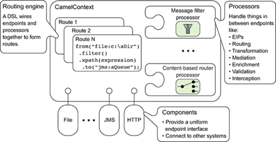
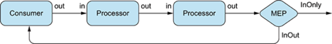
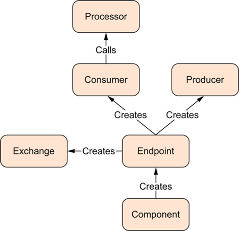
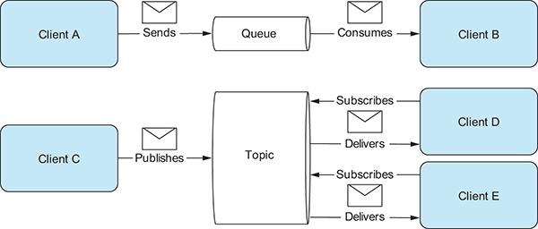
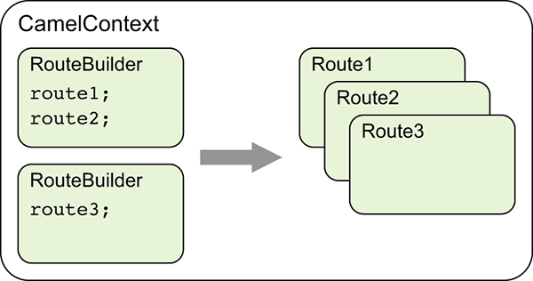
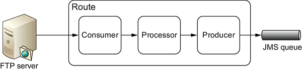

## What is Camel?

Core of the Camel framework is a routing engine—or more precisely, a routing-engine builder.

It allows you to define your own routing rules, decide from which sources to accept messages,
and determine how to process and send those messages to other destinations.

Camel uses an integration language that allows you to define complex routing rules

One of the fundamental principles of Camel is that it makes no assumptions about the type of data you need to process.
**This is an important point,** an opportunity to integrate any kind of system, without the need to convert your data to a canonical format.

These architectural choices eliminate the need for unnecessary conversions and make Camel not only faster but also lean.

## Why use Camel?
- Routing and mediation engine
  - A routing engine selectively moves a message around, based on the route’s configuration.
  In Camel’s case,routes are configured with a combination of enterprise integration patterns and 
  a domain-specific language

- Extensive component library
  These components enable Camel to connect over transports, use APIs, and understand data formats.

- Enterprise integration patterns (EIPs)

- Domain-specific language(DSL)
  ```   
  JAVA DSL:
  from("file:data/inbox").to("jms:queue:order");

  XML DSL:
  <route>
  <from uri="file:data/inbox"/>
  <to uri="jms:queue:order"/>
  </route>```

- Payload-agnostic router
  - Camel can route any kind of payload; you aren’t restricted to carrying a normalized format such as XML payloads.
  - This freedom means you don’t have to transform your payload into a canonical format to facilitate routing

- Modular and pluggable architecture
  - Camel has a modular architecture, which allows any component to be loaded into Camel,
  regardless of whether the component ships with Camel, is from a third party, or is your own custom creation.
  - You can also configure almost anything in Camel. 
  - Many of its features are pluggable and configurable—anything from ID generation,
  thread management, shutdown sequencer, stream caching, and whatnot.

- Plain Old Java Object (POJO) model
  - Java beans (or Plain Old Java Objects, POJOs) are considered first-class citizens in Camel,
  and Camel strives to **let you use beans anywhere** and **anytime in your integration projects**.

- Easy configuration
- Automatic type converters
- Lightweight core ideal for microservices
- Cloud ready
- Test kit
- Vibrant community
- Getting Camel

#### **Camel uses two abstractions for modeling messages**

**org.apache.camel.Message:**  The fundamental entity containing the data being carried and routed in Camel.

**org.apache.camel.Exchange:** The Camel abstraction for an exchange of messages.
    This exchange of messages has an in message, and as a reply an out message.
    
- Message
  Messages are the entities used by systems to communicate with each other when using messaging channels.
  _Camel uses its own ID generator, uniquely_
    
- Headers and attachments
Headers are values associated with the message, such as sender identifiers, hints about content encoding, 
authentication information, and so on. 
Headers are name-value pairs; the name is a unique, case-insensitive string, and the value is of type java.lang.Object. 
Camel imposes no constraints on the type of the headers. 
There are also no constraints on the size of headers or on the number of headers included with a message. 
Headers are stored as a map within the message. 
A message can also have optional attachments, which are typically used for the web service and email components.

- Body
The body is of type java.lang.Object, so a message can store any kind of content and any size. 
It’s up to the application designer to make sure that the receiver can understand the content of the message. 
When the sender and receiver use different body formats, Camel provides mechanisms to transform the data into an acceptable format, 
and in those cases the conversion happens automatically with type converters, behind the scenes.

- Fault flag
Messages also have a fault flag. A few protocols and specifications, such as SOAP Web Services,
distinguish between output and fault messages. They’re both valid responses to invoking an operation, 
but the latter indicates an unsuccessful outcome. In general, faults aren’t handled by the integration infrastructure. 
They’re part of the contract between the client and the server and are handled at the application level.
During routing, messages are contained in an exchange.

Exchange
An exchange in Camel is the message’s container during routing.
exchange also provides support for the various types of interactions between systems,
also known as message exchange patterns (MEPs). MEPs are used to differentiate between one-way and request-response messaging styles.

InOnly—A one-way message (also known as an event message). For example, JMS messaging is often one-way messaging.
InOut—A request-response message. For example, HTTP-based transports are often request-reply: a client submits a web request, waiting for the reply from the server.
A Camel exchange has an ID, MEP, exception, and properties.
It also has an in message to store the incoming message, and an out message to store the reply.

    Exchange ID—A unique ID that identifies the exchange. Camel automatically generates the unique ID.
    
    MEP—A pattern that denotes whether you’re using the InOnly or InOut messaging style. When the pattern is InOnly, the exchange contains an in message. 
    For InOut, an out message also exists that contains the reply message for the caller.
    
    Exception—If an error occurs at any time during routing, an Exception will be set in the exception field.
    
    Properties—Similar to message headers, but they last for the duration of the entire exchange. 
    Properties are used to contain global-level information, whereas message headers are specific to a particular message. 
    Camel itself adds various properties to the exchange during routing. 
    You, as a developer, can store and retrieve properties at any point during the lifetime of an exchange.
    
    In message—This is the input message, which is mandatory. The in message contains the request message.
    
    Out message—This is an optional message that exists only if the MEP is InOut. The out message contains the reply message.
    
    The exchange is the same for the entire lifecycle of routing, but the messages can change, for instance, if messages are transformed from one format to another.

### Camel’s architecture
Camel is composed of routes, processors, and components. All of these are contained within CamelContext.



The services that CamelContext provides

# Routing engine
Camel’s routing engine is what moves messages under the hood.
This engine isn’t exposed to the developer, but you should be aware that it’s there and that it does all the heavy lifting,
ensuring that messages are routed properly.

# Routes
Routes are obviously a core abstraction for Camel. The simplest way to define a route is as a chain of processors.
There are many reasons for using routers in messaging applications. By decoupling clients from servers, and producers from consumers, routes can do the following:
Decide dynamically what server a client will invoke
Provide a flexible way to add extra processing
Allow for clients and servers to be developed independently
Foster better design practices by connecting disparate systems that do one thing well
Enhance features and functionality of some systems (such as message brokers and ESBs)
Allow for clients of servers to be stubbed out (using mocks) for testing purposes
Each route in Camel has a unique identifier that’s used for logging, debugging, monitoring, and starting and stopping routes.
Routes also have exactly one input source for messages, so they’re effectively tied to an input endpoint.
That said, there’s some syntactic sugar for having multiple inputs to a single route.

Take the following route, for example:
from("jms:queue:A", "jms:queue:B","jms:queue:C").to("jms:queue:D");

Camel clones the route definition into three separate routes. So, it behaves similarly to three separate routes as follows
from("jms:queue:A").to("jms:queue:D");
from("jms:queue:B").to("jms:queue:D");
from("jms:queue:C").to("jms:queue:D");

Even though it’s perfectly legal in Camel 2.x, we don’t recommend using multiple inputs per route.
This ability will be removed in the next major version of Camel. To define these routes, we use DSL.

# Domain-specific language
To wire processors and endpoints together to form routes, Camel defines a DSL.
The term DSL is used a bit loosely here. In Camel, DSL means a fluent Java API that contains methods named for EIP terms.

    ```
    Consider this example: define a route that consumes files from a file endpoint. 
    from("file:data/inbox")
    .filter().xpath("/order[not(@test)]")
    .to("jms:queue:order");
    ```

    <route>
      <from uri="file:data/inbox"/>
      <filter>
        <xpath>/order[not(@test)]</xpath>
        <to uri="jms:queue:order"/>
      </filter>
    </route>

_hint: The DSLs provide a nice abstraction for Camel users to build applications with. Under the hood, though, a route is composed of a graph of processors_

# Processor

The processor is a core Camel concept that represents a node capable of using, creating, or modifying an incoming exchange.
During routing, exchanges flow from one processor to another; as such, you can think of a route as a graph having specialized processors as the nodes,
and lines that connect the output of one processor to the input of another.
Processors could be implementations of EIPs, producers for specific components, or your own custom creation.



Flow of an exchange through a route. Notice that the MEP determines whether a reply will be sent back to the caller of the route.

A route first starts with a consumer (think “from” in the DSL) that populates the initial exchange. At each processor step, the out message from the previous step is the in message of the next. In many cases, processors don’t set an out message, so in this case the in message is reused. At the end of a route, the MEP of the exchange determines whether a reply needs to be sent back to the caller of the route

If the MEP is InOnly, no reply will be sent back. If it’s InOut, Camel will take the out message from the last step and return it.
Producers and consumers in Camel may seem a bit counterintuitive at first.
After all, shouldn’t producers be the first node and consumers be consuming messages at the end of a route?
Don’t worry—you’re not the first to think like this!
Just think of these concepts from the point of view of communicating with external systems.
Consumers consume messages from external systems and bring them into the route.
Producers, on the other hand, send (produce) messages to external systems.

How do exchanges get in or out of this processor graph? To find out, you need to look at components and endpoints.

# Component

From a programming point of view, components are fairly simple: they’re associated with a name that’s used in a URI,
and they act as a factory of endpoints. For example, FileComponent is referred to by file in a URI,
and it creates FileEndpoints. The endpoint is perhaps an even more fundamental concept in Camel.

Endpoint acts as a factory for creating consumers and producers that are capable of receiving and
sending messages to a particular endpoint.

# Producer

A producer is the Camel abstraction that refers to an entity capable of sending a message to an endpoint.

When a message is sent to an endpoint, the producer handles the details of getting the message data compatible with that particular endpoint.

FileProducer will write the message body to a file.
JmsProducer, on the other hand, will map the Camel message to javax.jms.Message before sending it to a JMS destination.
This is an important feature in Camel, because it hides the complexity of interacting with particular transports
All you need to do is route a message to an endpoint, and the producer does the heavy lifting.



How endpoints work with producers, consumers, and an exchange

# Consumer

A consumer is the service that receives messages produced by some external system, wraps them in an exchange,
and sends them to be processed.

Consumers are the source of the exchanges being routed in Camel.

To create a new exchange, a consumer will use the endpoint that wraps the payload being consumed.
A processor is then used to initiate the routing of the exchange in Camel via the routing engine.

Camel has two kinds of consumers: event-driven consumers and polling consumers.
The differences between these consumers are important, because they help solve different problems.

- Event-driven consumer
  This kind of consumer is mostly associated with client-server architectures and web services.
  It’s also referred to as an asynchronous receiver in the EIP world.
  An event-driven consumer listens on a particular messaging channel, such as a TCP/IP port,
  MS queue, Twitter handle, Amazon SQS queue, WebSocket, and so on. It then waits for a client to send messages to it.
  When a message arrives, the consumer wakes up and takes the message for processing

- Polling consumer
  the polling consumer actively goes and fetches messages from a particular source, such as an FTP server.
  The polling consumer is also known as a synchronous receiver in EIP lingo,
  because it won’t poll for more messages until it’s finished processing the current message.
  A common flavor of the polling consumer is the scheduled polling consumer, which polls at scheduled intervals.
  File, FTP, and email components all use scheduled polling consumers.


### 2. ROUTING WITH CAMEL

Camel would be a library of transport connectors.

In Camel, routing is a more general concept.
It’s defined as a step-by-step movement of the message, which originates from an endpoint in the role of a consumer.
The consumer could be receiving the message from an external service, polling for the message on a system,
or even creating the message itself. This message then flows through a processing node, which could be
an enterprise integration pattern (EIP), a processor, an interceptor, or another custom creation.
The message is finally sent to a target endpoint that’s in the role of a producer.
A route may have many processing components that modify the message or send it to another location,
or it may have none, in which case it would be a simple pipeline.

# What is JMS?

Queues are strictly point-to-point; each message has only one consumer.
Topics operate on a publish/subscribe scheme;
a single message may be delivered to many consumers if they’ve subscribed to the topic.



JMS also provides a ConnectionFactory that clients (for example, Camel) can use to create a connection with a JMS provider.
JMS providers are usually referred to as brokers because they manage the communication between a message producer
and a message consumer

# How to configure Camel to use a JMS provider

Apache ActiveMQ is one of the most popular open source JMS providers,
and it’s the primary JMS broker that the Camel team uses to test the JMS component.

ConnectionFactory connectionFactory = new ActiveMQConnectionFactory("vm://localhost");

CamelContext context = new DefaultCamelContext();
context.addComponent("jms", JmsComponent.jmsComponentAutoAcknowledge(connectionFactory));

Creating routes in Java
RouteBuilders are used to create routes in Camel. Each RouteBuilder can create multiple routes.


- Using RouteBuilder: need to add the class to CamelContext with the addRoutes

Using the Java DSL
- Adding a processor
  This gives you full access to the message exchange, letting you do pretty much whatever you want with the payload or headers.
  

Bean injection and Spring

Camel can be configured as if it were another bean. Recall how you configured the JMS component to connect to an ActiveMQ broker
`ConnectionFactory connectionFactory = new ActiveMQConnectionFactory("vm://localhost");
CamelContext context = new DefaultCamelContext();
context.addComponent("jms", JmsComponent.jmsComponentAutoAcknowledge(connectionFactory));`

But where’s CamelContext defined in Spring?
Camel uses Spring extension mechanisms to provide custom XML syntax for Camel concepts within the Spring XML file.
To load up CamelContext in Spring. This automatically starts SpringCamelContext,
which is a subclass of DefaultCamelContext, which you used for the Java DSL

>Adding a processor
>Using multiple routes

Using Camel and Spring
>Finding route builders
Using the Spring CamelContext as a runtime and the Java DSL for route development is a great way to use Camel
The contextScan element takes advantage of Spring’s component-scan feature to load any Camel route builders that are marked with the
org.springframework.stereotype.@Component annotation

The Camel Properties component uses the {{key}} syntax, whereas Spring uses ${key}.

- Using Spring property placeholders
  The Spring Framework supports externalizing properties defined in the Spring XML files by using a feature known as Spring property placeholders

- Using raw values in endpoint URIs
  from("ftp://rider.com/orders?username=rider&password=RAW(++%%w?rd)")


- Referencing registry beans in endpoint URIs
  Anytime a Camel endpoint requires an object instance as an option value, refer to one in the registry by using the # syntax.
- For example, say you want to fetch only CSV order files from the FTP site. You could define a filter like so:

```
public class OrderFileFilter<T> implements GenericFileFilter<T> {
public boolean accept(GenericFile<T> file) {
return file.getFileName().endsWith("csv");
}
}

registry.bind("myFilter", new OrderFileFilter<Object>());

from("ftp://rider.com/orders?username=rider&password=secret&filter=#myFilter")
```

- Using a content-based router
