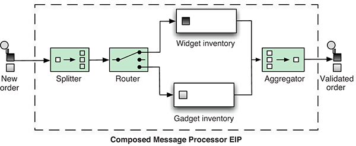
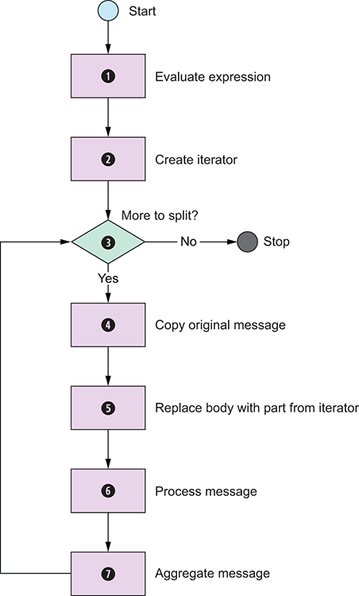

### 3. Transforming data with Camel

- USING THE GETIN AND GETOUT METHODS ON EXCHANGES

The Camel Exchange defines two methods for retrieving messages: getIn and getOut. The getIn method returns the incoming message, and the getOut method accesses the outbound message.

In two scenarios, the Camel end user will have to decide which method to use:

A read-only scenario, such as when you’re logging the incoming message
A write scenario, such as when you’re transforming the message

In the second scenario, you’d assume getOut should be used. That’s correct according to theory, but in practice there’s a common pitfall when using getOut: the incoming message headers and attachments will be lost. This is often not what you want, so you must copy the headers and attachments from the incoming message to the outgoing message, which can be tedious. The alternative is to set the changes directly on the incoming message by using getIn, and not to use getOut at all. This is the practice we use most often in this book.

- Transforming using the transform method from the Java DSL

transform is a method in the Java DSL that can be used in Camel routes to transform messages. By allowing the use of expressions, transform permits great flexibility, and using expressions directly within the DSL can sometimes save time.

`from("direct:start")
.transform(body().regexReplaceAll("\n", " "))
.to("mock:result");`

### 4.Using beans with Camel

> This chapter covers
Calling Java beans with Camel
Understanding the Service Activator EIP
How Camel looks up beans using registries
How Camel selects bean methods to invoke
Using bean parameter bindings
Using Java beans as predicates or expressions in routes

the Camel Processor, which clutters the route, making it harder to understand what happens

### 5. Enterprise integration patterns

> This chapter covers
The Aggregator EIP: Used to combine results of individual but related messages into a single outgoing message. You can view this as the reverse of the Splitter pattern
The Splitter EIP: Used to split a message into pieces that are routed separately.
The Routing Slip EIP: Used to route a message in a series of steps; the sequence of steps isn’t known at design time and may vary for each message.  
The Dynamic Router EIP: Used to route messages with a dynamic router dictating where the message goes.
The Load Balancer EIP: Used to balance the load to a given endpoint by using a variety of balancing policies

- The Aggregator and Splitter EIPs
  The Splitter can split a single message into multiple submessages, and the Aggregator can combine those submessages back into a single message. They’re opposite patterns.

- Using the Splitter
  Using the Splitter in Camel is straightforward, so let’s try a basic example that will split one message into three messages,
  each containing one of the letters A, B, and C. The following listing shows the example using a Java DSL–based
  Camel route and a unit test

`public class SplitterABCTest extends CamelTestSupport {
public void testSplitABC() throws Exception {
MockEndpoint mock = getMockEndpoint("mock:split");
mock.expectedBodiesReceived("A", "B", "C");
List<String> body = new ArrayList<String>();
body.add("A");
body.add("B");
body.add("C");
template.sendBody("direct:start", body);
assertMockEndpointsSatisfied();
}
protected RouteBuilder createRouteBuilder() throws Exception {
return new RouteBuilder() {
public void configure() throws Exception {
from("direct:start")
.split(body())     
.log("Split line ${body}")
.to("mock:split");
}
};
}
}`

